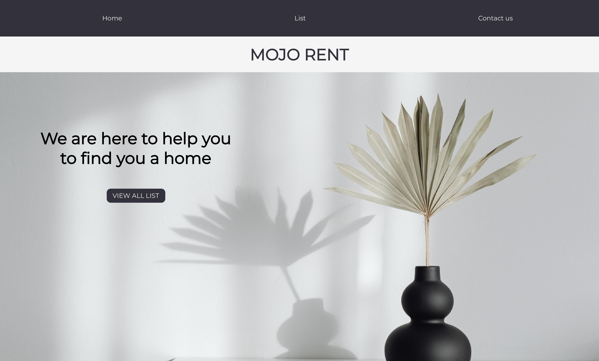
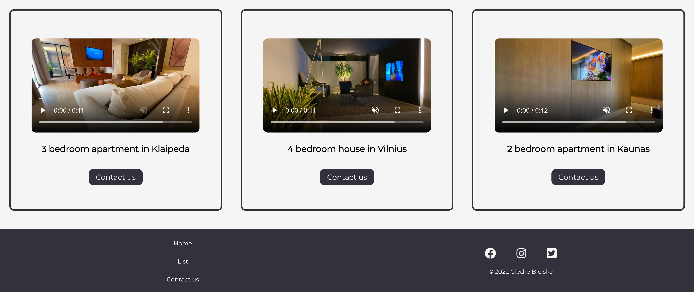

# BIT_SPRINT_2

Project was created for learning purposes. It's a promotional page for a real estate company.

### About project

* Website include 3 pages:
  - Home 
  - List of items 
  - Contact

* Made with HTML and CSS

* Have two branches:
  - **main**  (this is basic version of website)
  - **premium-branch** (this is moderate version with logo animation and video)

### How to instal
###### Start with preparation
1. First you need to clone repository.
Copy link of repository here:

Go to the folder where you want clone repository, then open GIT BASH there. 
Then use command 

*you need to have Visual Studio Code. If you don't have it you can download [here](https://code.visualstudio.com/)
* You will need to have few extensions in VSCode:
 - 
 - Live Sass Compiler v5.3.0 (be aware wich version of extension you download, because in VScode are two almost same Lice Sass Compiler)
 * Open settings and in search bar tab sass. Then scroll down and find section Live Sass Compiler: Settings: Formats 

Nuotrauka

Then chose settings button and press Copy Setting as JSON:

Nuotrauka 

In the same section press on Edit in settings.json. Then you need to paste code which you copied before like this:

Nuotrauka 